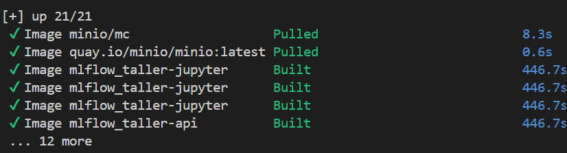
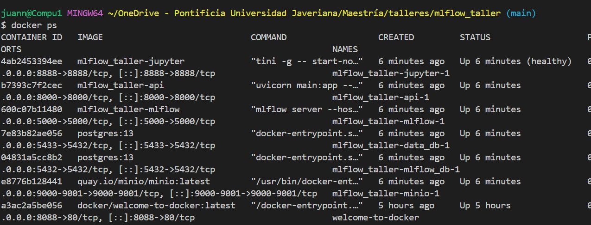
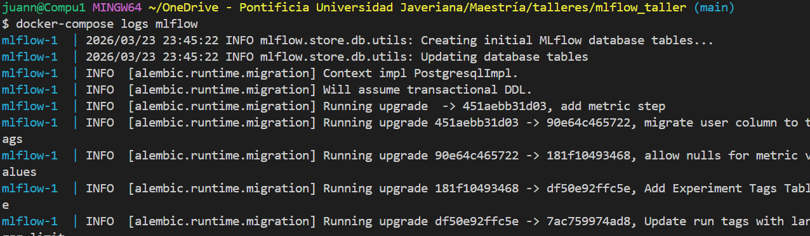
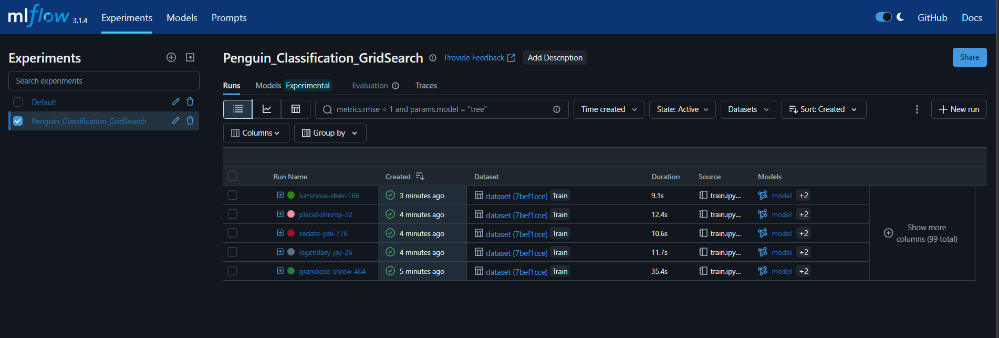
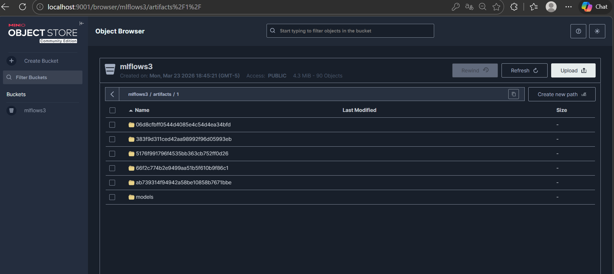
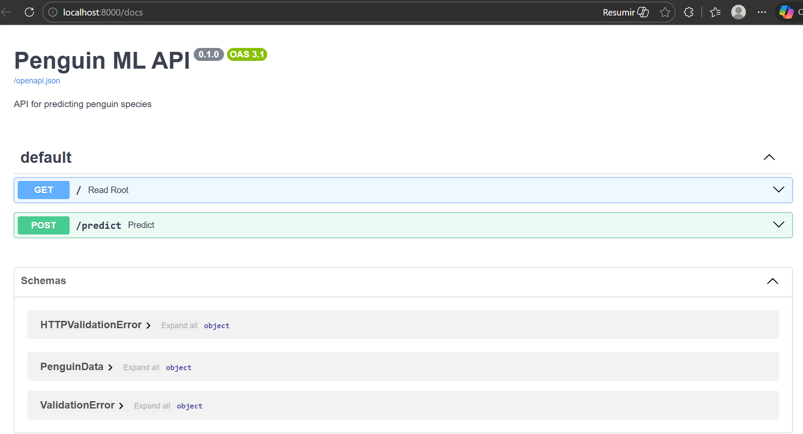

# MLflow Taller: Penguin Classification

Este repositorio contiene la solución al taller de MLflow, desplegando un entorno completo para experimentación y despliegue usando Docker Compose.

## Arquitectura del Servicio

- **MLflow DB (PostgreSQL):** Almacenamiento dedicado para los metadatos de MLflow.
- **Data DB (PostgreSQL):** Almacenamiento dedicado para los datos crudos y procesados, independiente de MLflow.
- **MinIO:** Almacenamiento de artefactos S3 en el bucket `mlflows3`.
- **MLflow:** Servidor para el registro y tracking de experimentos.
- **JupyterLab:** Entorno para el entrenamiento de modelos, configurado para conectar con bases de datos y MLflow.
- **FastAPI:** Servicio de API para realizar inferencia obteniendo el modelo más reciente registrado en MLflow.

## Instrucciones de Ejecución

1. Asegúrese de tener Docker y Docker Compose instalados.
2. Construya y levante los servicios:
   ```bash
   docker-compose up --build -d
   ```
3. Abra JupyterLab en http://localhost:8888. Cuando se le solicite un **Password or Token**, ingrese `mlflowtaller` para iniciar sesión. Luego, navegue a `jupyter/data_setup.ipynb` para cargar los datos a la base de datos `data_db`.
4. Ejecute el notebook `jupyter/train.ipynb` para realizar el preprocesamiento, entrenar el modelo, y registrar las múltiples ejecuciones (27 iteraciones) a través de Grid Search usando MLflow.
5. Ingrese a MLflow en http://localhost:5000 para revisar los experimentos registrados y verificar que el modelo "PenguinModel" esté visible en Model Registry.
6. La API en http://localhost:8000 estará ya ejecutándose y cargará el modelo desde MLflow (reinicie el contenedor de la API si se levantó antes de registrar el modelo):
   ```bash
   docker-compose restart api
   ```
7. Pruebe la inferencia mediante peticiones POST a `http://localhost:8000/predict`. Para probar esto de manera más interactiva sin usar código ni Postman, ingrese a **http://localhost:8000/docs** desde su navegador, haga click en el botón `POST /predict`, pulse "Try it out" y envíe sus datos en formato JSON preconfigurado.

## Modelo Utilizado e Iteraciones (Grid Search)

Se implementó un pipeline en `scikit-learn` utilizando `RandomForestClassifier`. Los datos fueron extraidos de una base de datos PostgreSQL (`data_db`) donde posteriormente también se guardó una versión estructurada (`processed_penguins`).

El Grid Search se configuró explorando el siguiente espacio de hyperparámetros:

- `n_estimators`: [50, 100, 200]
- `max_depth`: [Ninguno, 5, 10]
- `min_samples_split`: [2, 5, 10]

Esto genera un total de **27 iteraciones**, asegurando el requisito establecido (múltiples ejecuciones, al menos 20 iteraciones con variaciones de hiperparámetros). Todas estas ejecuciones son automáticamente detectadas y guardadas por la función `mlflow.autolog()`, logrando que hiperparámetros, métricas (incluyendo accuracy, recall) y los propios artefactos de los sub-modelos se almacenen en MLflow y MinIO respectivamente. El mejor modelo evaluado durante el CV es el que termina siendo registrado de forma explícita en el "Model Registry" bajo el nombre **PenguinModel**.

Finalmente, el servicio FastAPI sirve el modelo utilizando la función de inferencia estándar del objeto estandarizado `pyfunc`, permitiendo interacciones API-to-Model en tiempo real.

---

## Evidencias de Ejecución

A continuación se describe el paso a paso de la ejecución realizada, el resultado esperado en cada etapa y el resultado obtenido, respaldado con pantallazos almacenados en la carpeta `evidencias/`.

---

### Paso 1 — Construcción y levantamiento de servicios

**Comando ejecutado:**
```bash
docker-compose up --build -d
```

**Resultado esperado:** Que todos los servicios (PostgreSQL ×2, MinIO, MLflow, JupyterLab, FastAPI) sean construidos y levantados sin errores, mostrando 21/21 ítems completados.

**Resultado obtenido:** Todos los contenedores fueron construidos exitosamente. Las imágenes `minio/mc` y `quay.io/minio/minio:latest` fueron descargadas (Pulled) y las imágenes `mlflow_taller-jupyter` y `mlflow_taller-api` fueron construidas localmente (Built) en ~446 segundos.

**Evidencia:** `Evidencias/contenedores_creados.png`



---

### Paso 2 — Verificación de contenedores activos

**Comando ejecutado:**
```bash
docker-compose ps
```

**Resultado esperado:** Los 6 servicios principales deben aparecer con estado `Up`.

**Resultado obtenido:** Todos los contenedores estaban activos: `mlflow_taller-jupyter-1` (healthy), `mlflow_taller-api-1`, `mlflow_taller-mlflow-1`, `mlflow_taller-data_db-1`, `mlflow_taller-mlflow_db-1` y `mlflow_taller-minio-1`, con sus puertos correctamente mapeados.

**Evidencias:** `Evidencias/DockerPS.png` · `Evidencias/Servicios funcionando  y activos.png`




---

### Paso 3 — Verificación del servidor MLflow

**Resultado esperado:** El servidor MLflow debe iniciar correctamente, conectarse a PostgreSQL y aplicar las migraciones de base de datos sin errores.

**Resultado obtenido:** Los logs mostraron que MLflow completó todas las migraciones de Alembic sobre la base de datos `mlflow_db` y quedó escuchando en el puerto 5000.

**Evidencia:** `Evidencias/MLflow_funcionando.png`



---

### Paso 4 — Ejecución del notebook `data_setup.ipynb`

**Acceso:** http://localhost:8888 (token: `mlflowtaller`)

**Resultado esperado:** El notebook debe leer el archivo `penguins_size.csv` (344 filas) y cargarlo en la tabla `raw_penguins` de la base de datos `data_db`.

**Resultado obtenido:** El notebook se ejecutó completamente sin errores. La salida confirmó: `"Loaded 344 rows from CSV"` y `"Successfully saved to database table 'raw_penguins'"`.

**Evidencia:** `Evidencias/notebook data_setupejecutado.png`


---

### Paso 5 — Ejecución del notebook `train.ipynb`

**Resultado esperado:** El notebook debe preprocesar los datos, ejecutar el Grid Search con 27 combinaciones de hiperparámetros, registrar cada run en MLflow mediante `autolog()`, y registrar el mejor modelo como `PenguinModel` en el Model Registry.

**Resultado obtenido:** El notebook se ejecutó correctamente. Se realizaron las 27 iteraciones del Grid Search. MLflow autolog registró automáticamente hiperparámetros, métricas y artefactos por cada run. Al finalizar, el mejor modelo fue registrado en el Model Registry bajo el nombre `PenguinModel`.

**Evidencia:** `Evidencias/notebook train ejecutado.png`


---

### Paso 6 — Experimentos en MLflow UI

**Acceso:** http://localhost:5000

**Resultado esperado:** La interfaz de MLflow debe mostrar el experimento `Penguin_Classification_GridSearch` con los 27 runs registrados, cada uno con sus métricas y parámetros.

**Resultado obtenido:** El experimento fue visible en la UI de MLflow con todos los runs completados (estado verde). Cada run incluía métricas de entrenamiento y referencias al dataset utilizado. La pestaña **Models** mostró los modelos registrados para cada run, incluyendo `PenguinModel` en el Model Registry.

**Evidencias:** `Evidencias/InterfazMLFlow.png` · `Evidencias/Exprimentos MLFlow.png`




---

### Paso 7 — Artefactos almacenados en MinIO

**Acceso:** http://localhost:9001 (usuario: `admin`, contraseña: `supersecret`)

**Resultado esperado:** El bucket `mlflows3` debe contener los artefactos (modelos serializados, métricas, etc.) generados por cada run de MLflow.

**Resultado obtenido:** El Object Browser de MinIO mostró el bucket `mlflows3` con múltiples carpetas de artefactos correspondientes a los runs del experimento, incluyendo los modelos entrenados.

**Evidencia:** `Evidencias/artefactosenMinIO.png`



---

### Paso 8 — Documentación interactiva de la API

**Acceso:** http://localhost:8000/docs

**Resultado esperado:** La documentación Swagger UI debe mostrar los endpoints disponibles: `GET /` y `POST /predict`.

**Resultado obtenido:** La interfaz Swagger de la **Penguin ML API** fue accesible, mostrando correctamente los dos endpoints y los esquemas de datos (`PenguinData`, `HTTPValidationError`, `ValidationError`).

**Evidencia:** `Evidencias/Documentacion_API__Swager.png`



---

### Paso 9 — Predicción vía API

**Comando ejecutado:**
```bash
curl -X POST "http://localhost:8000/predict" \
  -H "Content-Type: application/json" \
  -d "{\"island\": \"Biscoe\", \"culmen_length_mm\": 46.1, \"culmen_depth_mm\": 13.2, \"flipper_length_mm\": 211.0, \"body_mass_g\": 4500.0, \"sex\": \"MALE\"}"
```

**Resultado esperado:** La API debe retornar la especie de pingüino predicha por el modelo en formato JSON.

**Resultado obtenido:** La API respondió exitosamente con `{"prediction":"Gentoo"}`, confirmando que el modelo `PenguinModel` fue cargado correctamente desde MLflow y está sirviendo predicciones en tiempo real.

**Evidencia:** `Evidencias/predicción_solicitada_via_API.png`


